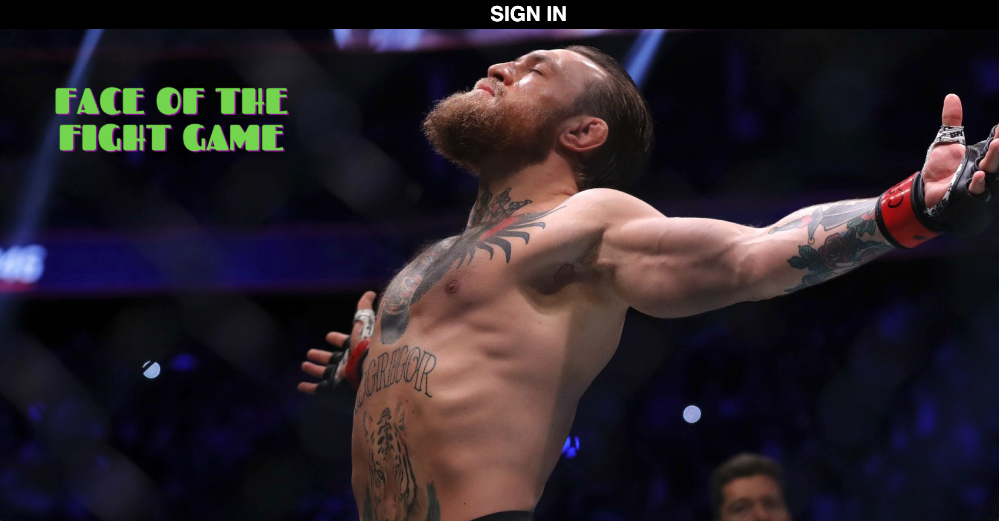

# **FACE OF THE FIGHT GAME**

The FIGHT GAME, for short, allows a logged in user to sign a fighter with the use of a form or contract. It's tough to be a fighter, but this app makes being a UFC president possible!

With each signing, a fighter's biography can be completely uploaded, including photo, current record, age and so on. They will be on their way to becoming a reigning world's champion.

A logged in user can also equip a fighter they've signed with skills and training equipment to make them a more viable championship contender. After providing their character with a suitable training camp, their fighter can be pinned against another user's fighter in a completely sanctioned main event of a major fight card. If a user's opponent is the current champion of their weight class and the opponent is defeated, then user's fighter becomes the undisputed champion of the world and rises to to the top of the mixed martial arts mountain.

The event winners are simulated based on their training. Have they received adequate training equipment and skills necessary for the big win? It is up to you to make sure your fighter is ready for competition! All equipment and skills can be acquired through the store. If your fighter has a stronger foundation through purchases from the store, they will have a stronger training camp than their opponent. Being more prepared will dramatically increase their odds of winning to 75/25. Of course, in reality, a fighter cannot have a 100% chance of winning due to the fact that every fighter has a "puncher's chance" of upsetting their opponent.

Are you ready to be a UFC promoter? Are you ready to work hard and pursue your dream of becoming a UFC champion? Become the face of the fight game!

## Screenshots

## Technologies Used

- EXPRESS
- MONGODB
- HTML
- CSS
- JavaScript

## Getting Started

The app can be accessed [here](https://mma-fight-game.herokuapp.com/).

## Future Work

- **A more sophisticated event simulator:**
  I would like to complicate how the simulation determines a winner. It's not enough to have a 75/25 win as more training should lead to a higher probability to win. However, I must take into account that even too much training can lead to a plateau.
- **Updating fighter records:**
  I would like a win or loss to impact the fighter's record overall. There must be incentive for a fighter to win.
- **Add draw feature:**
  I would like to add a draw feature to the game as part of the simulation. In real MMA, a draw and no contest outcome may result when the match does not reach a climactic conclusion.
- **Add more matches:**
  I would like to add more matches to the event feature. Every real UFC event has at least five fights on its main card. So far, I've only implemented one match.
- **Implement store to take payments**
  Have a store that can take transactions would be useful as to limit how much equipment and skill a user's fighter can have. Knowing that it costs money to level up will prevent a user from spamming a player's stats.
